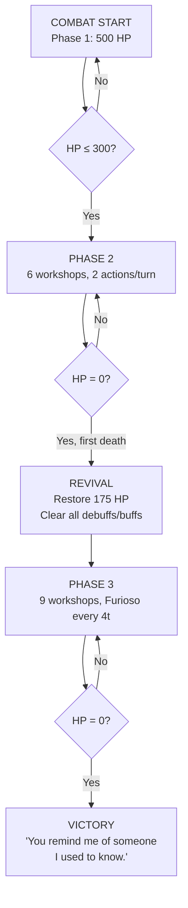

# The Black Silence — Superboss Blueprint

> *"That's that, and this is this."*
>
> — The Black Silence, *Library of Ruina*

---

## Table of Contents

1. [Overview](#overview)
2. [Lore & Encounter](#lore--encounter)
3. [Enemy Definition](#enemy-definition)
4. [Phase Breakdown](#phase-breakdown)
5. [The Workshop Arsenal](#the-workshop-arsenal)
6. [Phase 1 — The Silent Fixer](#phase-1--the-silent-fixer)
7. [Phase 2 — True Form](#phase-2--true-form)
8. [Phase 3 — Furioso](#phase-3--furioso)
9. [The Revival — "That's That, and This is This"](#the-revival--thats-that-and-this-is-this)
10. [Combat Flow Diagram](#combat-flow-diagram)
11. [Hooks Implementation](#hooks-implementation)
12. [Context State Keys](#context-state-keys)
13. [Attack Reference Table](#attack-reference-table)
14. [Dialogue & Narration](#dialogue--narration)
15. [Loot & Post-Combat](#loot--post-combat)
16. [Edge Cases](#edge-cases)
17. [Tuning Levers](#tuning-levers)
18. [Implementation Checklist](#implementation-checklist)

---

## Overview

| Property | Value |
|---|---|
| **Name** | The Black Silence |
| **Module** | `combat/black_silence.py` |
| **Function** | `combat_black_silence(player, floor=None, enemies=None)` |
| **Enemy Key** | `black_silence` |
| **Rarity** | Superboss |
| **Level** | 28 |
| **Location** | TBD (recommend: a hidden sanctum unlocked after defeating at least 2 other superbosses) |
| **Phases** | 3 (Phase 1 → Revival → Phase 2 → Phase 3) |
| **Core Gimmick** | Uses the same 9 workshop attacks the player's gloves would grant. Builds toward Furioso. Revives once. |
| **Drop** | `certain_someone_black_gloves` (100%), + a cosmetic/vanity item |

---

## Lore & Encounter

### Encounter Text

```
You find yourself in a ruined workshop — or perhaps nine workshops, 
collapsed into one another like a deck of cards shuffled by grief.

A figure stands in the center. Black coat. Black gloves. No face — 
only a mask of silence.

They do not speak. They do not need to. The gloves clench.

Nine names are stitched into the leather. They whisper.
```

### Post-Revival Text

```
The body falls. The silence deepens.

Then — a heartbeat. Singular. Defiant.

The figure rises. The mask is gone. Beneath it: eyes that have seen 
everything and lost more.

"...That's that, and this is this."

The gloves ignite. All nine voices scream at once.
```

### Victory Text

```
The Black Silence kneels. The gloves fall still.

For a long moment, there is only silence — not the silence of absence, 
but the silence of peace. Of an oath finally fulfilled.

The figure looks at you, and for the first time, almost smiles.

"You remind me of someone I used to know."

They press the gloves into your hands. They are warm. They are waiting.
```

---

## Enemy Definition

```yaml
# resources/enemies/enemies_data/superbosses.yaml

black_silence:
  name: The Black Silence
  race: Human
  level: 28
  base_hp: 500
  mods:
    Strength: 10
    Constitution: 7
    Dexterity: 12
    Wisdom: 4
    Learning: 8
    Charisma: 6
  boss: true
  super_boss: true
  elemental_res:
    dark: 0.7     # Resistant to dark (thematic — silence counters darkness)
    light: 1.3    # Weak to light
    thunder: 1.2  # Weak to thunder (sound shatters silence)
  elemental_dmg:
    dark: 1.5
```

**Stat comparison to other superbosses:**

| Boss | Level | HP | STR | DEX | Notes |
|---|---|---|---|---|---|
| Slitcurrent | 21 | 420 | 8 | 6 | Adds, devour mechanic |
| Yinglong | 25 | 400 | 7 | 9 | 4 phases + adds |
| Rientrante | 25 | 420 | 10 | 6 | Frost, multi-action |
| **Black Silence** | **28** | **500** | **10** | **12** | Highest DEX, 3 phases, revive |

The Black Silence is fast (highest DEX among superbosses) and versatile (scales with STR/DEX/LER like the gloves), but has lower CON than tanks like Ignis.

---

## Phase Breakdown

```
                         ┌──────────────────┐
                         │   PHASE 1         │
                         │   The Silent Fixer │
                         │   HP: 100% → 60%  │
                         │   4 workshops      │
                         │   Cycle every 2t   │
                         └────────┬─────────┘
                                  │ HP ≤ 60%
                                  ▼
                         ┌──────────────────┐
                         │   PHASE 2         │
                         │   True Form       │
                         │   HP: 60% → 0%    │
                         │   6 workshops      │
                         │   2 actions/turn   │
                         │   Faster cycling   │
                         └────────┬─────────┘
                                  │ HP = 0 (first time)
                                  ▼
                         ┌──────────────────┐
                         │   REVIVAL         │
                         │   "That's that..." │
                         │   Restore 55% HP  │
                         │   Clear debuffs   │
                         └────────┬─────────┘
                                  │
                                  ▼
                         ┌──────────────────┐
                         │   PHASE 3         │
                         │   Furioso         │
                         │   HP: 55% → 0%    │
                         │   All 9 workshops  │
                         │   Furioso every 4t │
                         └──────────────────┘
```

---

## Phase 1 — The Silent Fixer

> *The Black Silence moves with mechanical precision. Four weapons. No wasted motion.*

### Stats (Phase 1)

| Property | Value |
|---|---|
| HP Threshold | 100% → 60% |
| Workshops Available | 4 (randomly selected each cycle) |
| Actions Per Turn | 1 |
| Cycle Duration | 2 turns (then re-roll 4 workshops) |

### Workshop Selection (Phase 1)

At the start of Phase 1, and every 2 turns thereafter, the boss randomly selects **4 of the 9 workshops** to have available. This creates variety across attempts — you never know which tools the Silence brings.

```
Pool: [Allas, Wheels, Zelkova, Old Boys, Mook, Ranga, Crystal, Logic, Durandal]
Draw 4 without replacement. Boss uses one per turn, cycling through.
After all 4 used or 2 turns pass → re-roll.
```

### AI Decision (Phase 1)

```
Priority order:
1. If boss HP < 30%: Use Mook (AoE lifesteal) if available
2. If player has dodge buff: Use Allas (DEF pierce) if available
3. If player ≤ 50% HP: Use Old Boys (stun) if available
4. If player not bleeding: Use Ranga (bleed) if available
5. Random among remaining available workshops
```

### Attack Scaling (Phase 1)

```
Boss workshop damage = (d4-10) + scaling_stat − player_CON
where scaling_stat = boss_str for STR workshops, boss_dex for DEX, etc.
Boss effective stats are from the enemy definition.

Enemy workshop multipliers are the SAME as player gloves multipliers
(see Attack Reference Table below).
```

---

## Phase 2 — True Form

> *The Silence sheds its restraint. Six weapons now — and they're getting faster.*

### Trigger

When Black Silence HP ≤ 60% of max (first HP bar: 500 → 300 HP).

### Transition Narration

```
The Black Silence staggers. The mask cracks — not physically, but in 
the way reality bends around them. They roll their shoulders. 

A fifth glove materializes from shadow. Then a sixth.

"No more holding back."
```

### Stats (Phase 2)

| Property | Value |
|---|---|
| HP Threshold | 60% → 0% (300 → 0) |
| Workshops Available | 6 (randomly selected each cycle) |
| Actions Per Turn | **2** (two different workshops) |
| Cycle Duration | Re-roll workshops every 2 turns |
| DEX Bonus | +2 (becomes 14 effective DEX — even faster initiative) |

### Two Actions Per Turn

In Phase 2, the Black Silence takes **two actions** on its turn. It must use two **different** workshop attacks. This dramatically increases pressure — it can combine stun + bleed, or AoE lifesteal + DEF pierce.

```
Action 1: Choose per AI priority
Action 2: Choose per AI priority (must differ from Action 1)
```

### AI Decision (Phase 2)

```
Priority order (Action 1):
1. If boss HP < 25% AND Mook available: Mook (lifesteal)
2. If player is defending: Allas (DEF pierce)
3. If player HP ≤ 40% AND Old Boys available: Old Boys (stun)
4. If player not bleeding AND Ranga available: Ranga (bleed)
5. If Crystal Atelier available AND boss has no dodge buff: Crystal (+20% dodge)
6. Random among remaining

Priority order (Action 2):
1. If Action 1 wasn't Mook AND boss HP < 55% AND Mook available: Mook
2. If Action 1 wasn't stun AND player HP ≤ 50%: Old Boys or Wheels (stun)
3. If Action 1 wasn't bleed AND Ranga available: Ranga
4. Zelkova (two hits, consistent damage)
5. Random among remaining (different from Action 1)
```

---

## Phase 3 — Furioso

> *All nine workshops ignite at once. The gloves sing a chorus of annihilation.*

### Trigger

When Black Silence HP reaches 0 for the **first time**, instead of dying, the Revival sequence triggers (see next section). After revival, Phase 3 begins.

### Stats (Phase 3)

| Property | Value |
|---|---|
| HP | 55% of max restored |
| Workshops Available | **All 9** |
| Actions Per Turn | 1 (but each action is devastating) |
| Furioso Timer | Every 4 turns |

### Workshop Cycling (Phase 3)

All 9 workshops are available. The boss uses one per turn, cycling through a pre-determined sequence or random selection. Once all 9 are used at least once → **Furioso** on the next turn.

```
Turn counter: 1 2 3 4 5 6 7 8 9 → FURIOSO → reset
(Boss can use Furioso before all 9 if 4 turns have passed — whichever comes first)
```

### Boss Furioso

When the Black Silence uses Furioso, it executes all 9 workshop attacks in sequence against the player (and allies if applicable):

```
Sequence: Allas → Wheels → Zelkova → Old Boys → Mook → 
          Ranga → Crystal → Atelier Logic → Durandal

Each hit:
- Uses the SAME multipliers as the player gloves' Furioso (0.75× damage)
- Effects at 50% potency
- All 9 hits target the PLAYER (single target, unlike player's round-robin)
- No target switching — this is personal

Narration during Furioso:
  "Allas Workshop — your guard means nothing!"
  "Wheels Industry — the air itself shatters!"
  "Zelkova Workshop — too fast to follow!"
  "Old Boys Workshop — brutality incarnate!"
  "Mook Workshop — your life becomes theirs!"
  "Ranga Workshop — blood paints the floor!"
  "Crystal Atelier — a moment of crystalline calm..."
  "Atelier Logic — calculated annihilation!"
  "DURANDAL — THE SWORD THAT ENDS ALL!"
```

### Player Counterplay During Phase 3

- **Defend** cuts all Furioso damage by the normal defend multiplier
- **Dodge buffs** help but at 50% effect potency during Furioso, stuns may still land
- Killing the boss before the 4-turn timer resets is the ideal strategy
- Silence does NOT block workshop attacks (they're martial)

---

## The Revival — "That's That, and This is This"

> *The most dangerous moment in the fight isn't the start — it's when you think you've won.*

### Trigger

When Black Silence HP reaches 0 in Phase 2 (the FIRST time the boss dies).

### Sequence

```
1. Boss HP reaches 0
2. Display: "The Black Silence collapses. The gloves fall still."
3. Pause (c_input)
4. Display: "..." (dramatic pause)
5. Display: "A heartbeat. Singular. Defiant."
6. Display: "The figure rises. The mask is gone."
7. Display: '"...That\'s that, and this is this."'
8. Boss HP restored to 55% of max
9. All debuffs on boss cleared (stun, bleed, poison, etc.)
10. All buffs on boss cleared (dodge, etc.)
11. Phase 3 begins
```

### Mechanical Implications

- The boss effectively has **~635 total HP** across all phases
- The revival is NOT a second health bar — it resets to 55%, not 100%
- Debuff cleansing means you need to re-apply bleed/stun/etc. in Phase 3
- Phase 3 starts with the boss at full offensive capability
- If you blew all your cooldowns in Phase 2, Phase 3 will be rough

### What happens during revival

- The combat loop pauses. No initiative is rolled.
- This is a **narrative transition**, not a full round.
- After the revival sequence, the next round begins normally with initiative.

---

## Combat Flow Diagram



---

## Hooks Implementation

Following the existing superboss pattern (`superboss_combat_loop` with hooks):

### Module Structure

```python
# combat/black_silence.py

def combat_black_silence(player, floor=None, enemies=None):
    boss_key = "black_silence"
    
    # Create boss (standard pattern)
    if enemies is None:
        boss = enemy_stats(boss_key, player)
        boss["max_hp"] = boss["hp"]
        enemies = [boss]
    else:
        # GUI mode: find boss in shared list
        ...
    
    # Opening narration
    ...
    
    context = {
        "phase": 1,                    # 1, 2, or 3
        "revived": False,              # Has revival happened?
        "phase2_triggered": False,     # Has phase 2 transition fired?
        "workshops_available": [],     # Currently available workshops [1-9]
        "workshops_used_this_cycle": [], # Used in current cycle
        "cycle_turns_remaining": 2,    # Turns until workshop re-roll
        "furioso_timer": 0,            # Turns until Furioso in Phase 3
        "phase2_dex_bonus_applied": False,
    }
    
    # Hooks
    def pre_player_hook(ctx, elist): ...
    def enemy_turn_hook(enemy, ctx, pl, p_con, defending, **kwargs): ...
    def post_round_hook(ctx, elist): ...
    
    return superboss_combat_loop(
        player, enemies, floor, "The Black Silence", context,
        pre_player_hook=pre_player_hook,
        enemy_turn_hook=enemy_turn_hook,
        post_round_hook=post_round_hook,
    )
```

### `pre_player_hook` — Phase Transitions

```python
def pre_player_hook(ctx, elist):
    boss = next((e for e in elist if e.get("key") == "black_silence"), None)
    if not boss:
        return
    
    hp_pct = boss["hp"] / boss["max_hp"]
    
    # Phase 1 → 2 transition
    if ctx["phase"] == 1 and hp_pct <= 0.60 and not ctx["phase2_triggered"]:
        ctx["phase"] = 2
        ctx["phase2_triggered"] = True
        ctx["cycle_turns_remaining"] = 0  # Force re-roll on next round
        boss["dex_mod"] += 2  # Permanent +2 DEX for Phase 2+
        _narrate_phase2_transition()
    
    # Re-roll workshops at start of each cycle
    if ctx["cycle_turns_remaining"] <= 0 or not ctx["workshops_available"]:
        _reroll_workshops(ctx)
```

### `enemy_turn_hook` — Boss Actions

```python
def enemy_turn_hook(enemy, ctx, pl, p_con, defending, **kwargs):
    if enemy.get("key") != "black_silence":
        return 1, False, None, 1.0, 0  # Normal attack for non-boss
    
    actions_per_turn = 2 if ctx["phase"] == 2 else 1
    
    for action_num in range(actions_per_turn):
        workshop_id = _select_workshop(ctx, enemy, pl, previous_pick=...)
        if workshop_id:
            _execute_boss_workshop(enemy, pl, workshop_id, ctx)
            ctx["workshops_used_this_cycle"].append(workshop_id)
    
    # Check Furioso trigger in Phase 3
    if ctx["phase"] == 3:
        ctx["furioso_timer"] += 1
        all_used = len(set(ctx["workshops_used_this_cycle"])) >= 9
        if ctx["furioso_timer"] >= 4 or all_used:
            _execute_boss_furioso(enemy, pl, ctx)
            ctx["furioso_timer"] = 0
            ctx["workshops_used_this_cycle"] = []
    
    return 0, True, None, 1.0, 0  # 0 normal attacks, fully handled
```

### `post_round_hook` — Cycle Management

```python
def post_round_hook(ctx, elist):
    ctx["cycle_turns_remaining"] -= 1
    
    boss = next((e for e in elist if e.get("key") == "black_silence"), None)
    if not boss:
        return
    
    # Check for death → revival
    if boss["hp"] <= 0 and not ctx["revived"]:
        _trigger_revival(boss, ctx)
        return
    
    # Phase 3: warn about Furioso
    if ctx["phase"] == 3 and ctx["furioso_timer"] >= 3:
        turns_left = 4 - ctx["furioso_timer"]
        c_print(f"⚠ The gloves glow brighter... Furioso in {turns_left} turn(s)!")
```

---

## Context State Keys

| Key | Type | Default | Description |
|---|---|---|---|
| `phase` | `int` | `1` | Current phase (1, 2, or 3) |
| `revived` | `bool` | `False` | Has the revival triggered? |
| `phase2_triggered` | `bool` | `False` | Has Phase 2 transition fired? |
| `workshops_available` | `list[int]` | `[]` | Workshop IDs [1-9] currently available |
| `workshops_used_this_cycle` | `list[int]` | `[]` | Workshops used in current cycle |
| `cycle_turns_remaining` | `int` | `2` | Turns until workshop re-roll |
| `furioso_timer` | `int` | `0` | Turns elapsed in Phase 3 (triggers Furioso at 4) |
| `phase2_dex_bonus_applied` | `bool` | `False` | Has the +2 DEX been applied? |

---

## Attack Reference Table

For both the boss and the player's gloves — identical multipliers ensure symmetry.

| # | Workshop | Scaling | Target | Dmg Mult | Special Effect | Boss AI Priority |
|---|---|---|---|---|---|---|
| 1 | Allas | STR | Single | 1.10× | Ignore 20% CON | High vs defending player |
| 2 | Wheels Industry | STR | AoE | 0.70× | 30% Stun each target | Medium (AoE pressure) |
| 3 | Zelkova | DEX | Single | 0.70× ×2 | Hit twice | Medium (reliable damage) |
| 4 | Old Boys | STR | Single | 1.00× | 65% Stun | High vs low HP player |
| 5 | Mook | WIS | AoE | 0.70× | 50% Lifesteal | High when boss injured |
| 6 | Ranga | DEX | Single | 1.00× | 70% Bleed (6×3t) | Medium-high |
| 7 | Crystal Atelier | DEX | Single | 0.90× | +20% Dodge, 2t | Medium (defensive setup) |
| 8 | Atelier Logic | WIS | Single | 2.00× | Once per cycle | Rare (high impact) |
| 9 | Durandal | LER | 3 random | 0.60× | 3 hits | Medium |

### Boss Damage Formula

```
For each workshop attack:
  scaling = boss["str_mod"] for STR workshops
          = boss["dex_mod"] for DEX workshops  
          = boss["wis_mod"] for WIS workshops (computed from 4 base Wisdom)
          = boss["ler_mod"] for LER workshops (computed from 8 base Learning)
  
  base = random(4, 10) + scaling
  final = int(base × workshop_multiplier)
  final = max(0, final − player_con)
  
  Player defending: final = int(final × defend_multiplier)
```

---

## Dialogue & Narration

### Combat Start
```
"..." (the Black Silence says nothing)
```

### Phase 1 → Phase 2 Transition (~60% HP)
```
The Black Silence staggers. The mask cracks.

A fifth glove materializes from shadow. Then a sixth.

"No more holding back."
```

### During Phase 2 — First Kill Attempt
```
(Normal attacks continue — no special dialogue until death)
```

### Revival Sequence
```
The Black Silence collapses. The gloves fall still.

...

A heartbeat. Singular. Defiant.

The figure rises. The mask is gone. Beneath it: eyes that have seen 
everything and lost more.

"...That's that, and this is this."

The gloves ignite. All nine voices scream at once.
```

### Boss Furioso (Phase 3)
```
The Black Silence extends both hands. Nine spectral weapons fan out 
behind them — a halo of steel and sorrow.

"FURIOSO."

[9 individual workshop narration lines]
```

### Upon Defeat
```
The Black Silence kneels. The gloves fall still.

For a long moment, there is only silence — not the silence of absence, 
but the silence of peace. Of an oath finally fulfilled.

"You remind me of someone I used to know."

They press the gloves into your hands. They are warm. They are waiting.
```

---

## Loot & Post-Combat

### Guaranteed Drop

| Item | Key | Notes |
|---|---|---|
| Certain Someone Black Gloves | `certain_someone_black_gloves` | 100% drop, only once per save |
| Black Silence's Mask | `perception_blocking_mask` (cosmetic) | Vanity / display item |

### Post-Combat Flag

```python
player["boss_defeated_black_silence"] = True
```

This flag can be used to:
- Prevent re-fighting (optional — your other superbosses allow re-fights)
- Unlock dialogue references in the city
- Gate access to a special facility or NPC

---

## Edge Cases

### 1. Player Dies During Revival
Revival is a narrative transition — no damage is dealt during it. The player cannot die here.

### 2. Boss Killed Before Phase 2 Triggers
If the player deals massive damage and skips from >60% to 0% in one attack, the boss **still goes through Phase 2 trigger and revival**. The sequence is forced:
```
Any hit that would kill in Phase 1 → Phase 1→2 transition fires first → 
then Phase 2 begins normally → then revival can happen from Phase 2.
```

### 3. Bleed/Poison Kills the Boss
If a DoT tick reduces boss HP to 0 in Phase 2, revival still triggers. The boss revives with 55% HP but DoTs are **cleared** during revival (all debuffs removed).

### 4. Player Uses Black Silence Gloves Against Black Silence
Thematic mirror match! No special interaction needed — but the symmetry is satisfying. The player and boss using the same 9 workshops creates a "anything you can do, I can do better" feel.

### 5. Multiple Enemies in the Fight
The Black Silence is designed as a solo boss. If other enemies are present (unlikely), workshop attacks use the same target selection as the player versions (single-target vs AoE as defined).

### 6. Boss Stunned During Phase 3 Furioso Timer
The Furioso timer only ticks on the boss's turns. If the boss is stunned, its turn is skipped, and the timer does NOT advance. Stunning the boss effectively delays Furioso.

---

## Tuning Levers

| Parameter | Value | Notes |
|---|---|---|
| Phase 1 HP | 500 | Standard superboss HP |
| Phase 1 workshop count | 4 | Out of 9 |
| Phase 1 cycle length | 2 turns | Re-roll workshops |
| Phase 2 trigger | 60% HP (300) | — |
| Phase 2 workshop count | 6 | More pressure |
| Phase 2 actions/turn | 2 | Must be different workshops |
| Phase 2 DEX bonus | +2 | Becomes 14 DEX |
| Revival HP restore | 55% | — |
| Phase 3 workshop count | 9 | All available |
| Phase 3 Furioso timer | 4 turns | Or all 9 used, whichever first |
| Boss Furioso multiplier | 0.75× per hit | Same as player Furioso |
| Boss Furioso effect potency | 50% | Halved stun/bleed/etc. |

### Estimated Total Damage Output

At 10 STR / 12 DEX / 8 LER / 4 WIS (boss stats):

| Phase | Per Turn (avg) | Notes |
|---|---|---|
| Phase 1 | ~15-22 | Single workshop attack |
| Phase 2 | ~28-40 | Two different workshops |
| Phase 3 (normal) | ~15-30 | Single, but more options |
| Phase 3 (Furioso) | ~100-130 | All 9 at 0.75× |
| **Total fight** | **~350-500 damage dealt** | Across ~15-25 turns |

A mid-to-late-game player with ~150-200 HP and healing options should find this challenging but survivable with good play.

---

## Implementation Checklist

### Phase 1: Data
- [ ] Add `black_silence` to `resources/enemies/enemies_data/superbosses.yaml`
- [ ] Add `certain_someone_black_gloves` to `resources/items.py` (per gloves blueprint)
- [ ] Add `perception_blocking_mask` vanity item (optional)

### Phase 2: Module Skeleton
- [ ] Create `combat/black_silence.py`
- [ ] Implement `combat_black_silence(player, floor, enemies)` entry point
- [ ] Set up context dict with all state keys
- [ ] Wire into `superboss_combat_loop` with all hooks

### Phase 3: Phase Logic
- [ ] Implement `_reroll_workshops(ctx)` — select 4/6/9 from pool
- [ ] Implement `_select_workshop(ctx, boss, player)` — AI priority decision
- [ ] Implement `_execute_boss_workshop(boss, player, workshop_id, ctx)` — execute one
- [ ] Implement Phase 1→2 transition
- [ ] Implement revival sequence
- [ ] Implement Phase 3 Furioso timer

### Phase 4: Boss Furioso
- [ ] Implement `_execute_boss_furioso(boss, player, ctx)`
- [ ] 9-attack sequence with narration
- [ ] State reset after Furioso

### Phase 5: Narration
- [ ] Opening text
- [ ] Phase transition narration
- [ ] Revival sequence with dramatic pauses
- [ ] Furioso per-attack narration lines
- [ ] Victory text

### Phase 6: Integration
- [ ] Add encounter trigger (dungeon, facility, or world event)
- [ ] Wire into GUI combat screen if applicable
- [ ] Add post-combat flag and loot delivery
- [ ] Add to any superboss tracking/achievement system

### Phase 7: Playtesting
- [ ] Test Phase 1→2 transition with overkill damage
- [ ] Test revival with DoT active
- [ ] Test Furioso against defending player
- [ ] Test stun interaction with Furioso timer
- [ ] Test with player also wearing black gloves (mirror match)
- [ ] Balance pass: is 175 HP in Phase 3 enough? Too much?

---

*Blueprint last updated: 2026-07-10*
